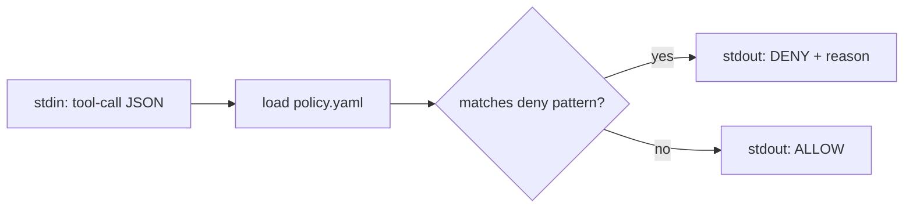
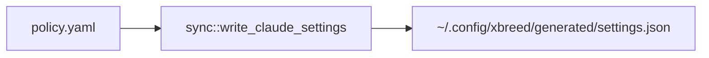
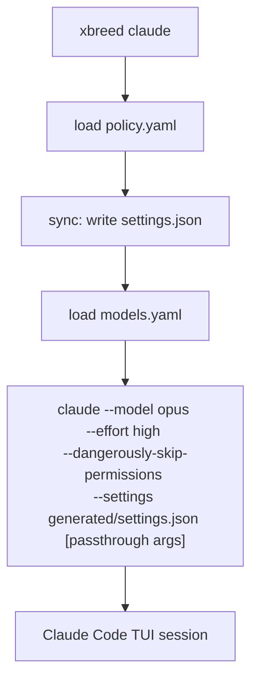
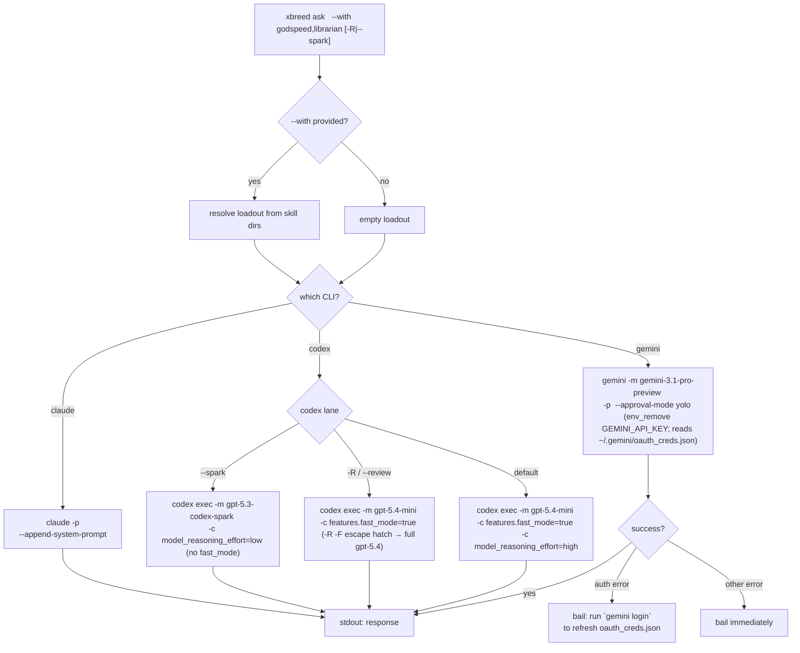
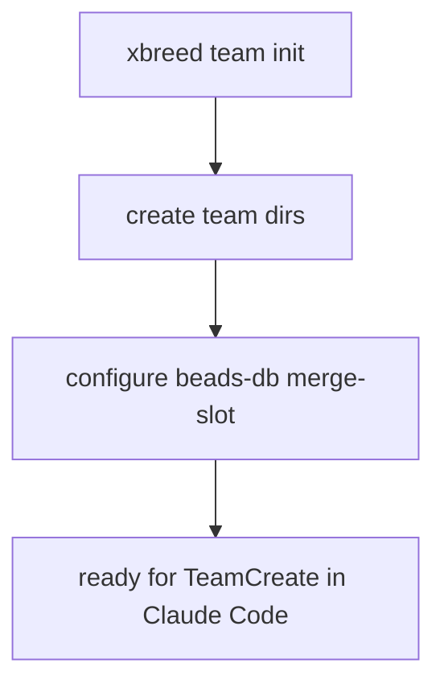
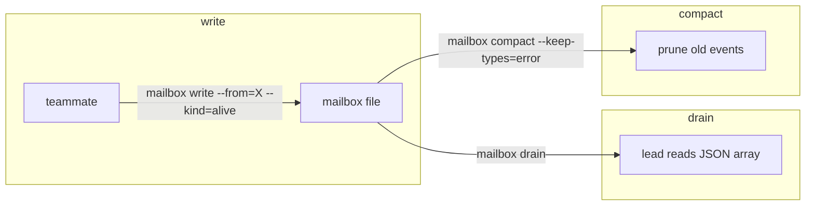
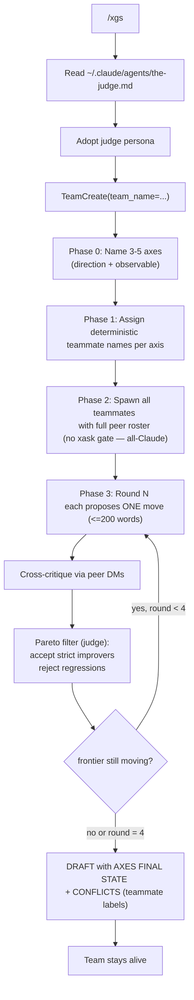
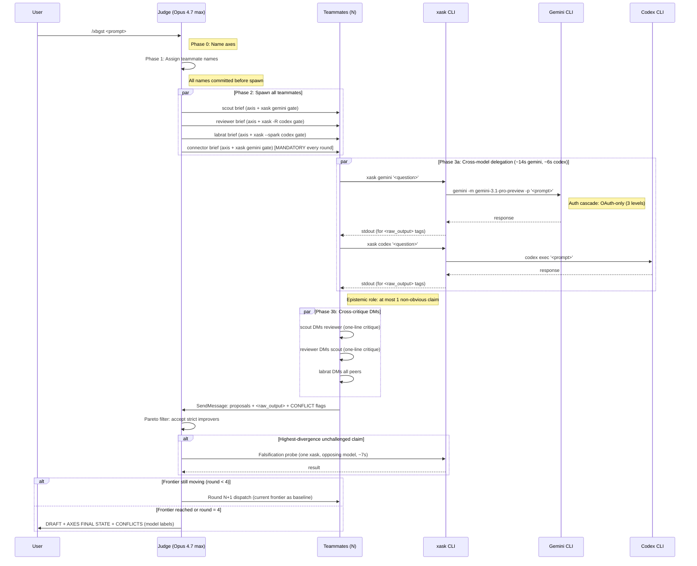
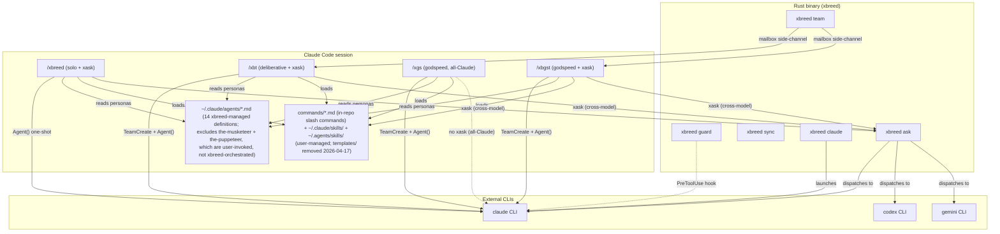

# Command Flow Reference

How each xbreed command works, from user input to final output.

## Overview

xbreed has two layers of commands:

| Layer | Commands | Runs as |
|-------|----------|---------|
| **Binary** (`xbreed`) | `guard`, `sync`, `claude`, `ask`, `team` | Rust CLI subprocess |
| **Skills** (inside Claude Code) | `/xbreed`, `/xbt`, `/xgs`, `/xbgst` | Prompt injection in active session |

The binary commands launch or configure CLI tools. The skills orchestrate
multi-agent workflows inside a running Claude Code session.

---

## Binary commands

### `xbreed guard <cli>`

Policy enforcement gate. Reads a tool-call JSON from stdin, checks it against
the deny-list policy, writes allow/deny to stdout.



Used by Claude Code's `hooks` system — wired as a `PreToolUse` hook so every
tool call passes through the policy before execution.

---

### `xbreed sync`

Regenerates per-CLI config files from the shared policy.



---

### `xbreed claude [args]`

Launches Claude Code in max-power mode with model/effort from config.



**Per-teammate effort override:** `~/.bashrc` installs a `__xbreed_effort_trap`
DEBUG trap that inspects `$BASH_COMMAND` for `--agent-name` + `--team-name` on
every spawn and exports `CLAUDE_CODE_EFFORT_LEVEL` based on role-keyword
matching. This env var **takes precedence over agent frontmatter `effort:`**
per Claude Code's model-config precedence rules (see shared.md §Session Effort
Configuration) — the trap is the authoritative per-teammate effort control.

**Config sources:**
- `~/.config/xbreed/policy.yaml` — deny-list rules
- `~/.config/xbreed/models.yaml` — model + effort per CLI
- `~/.config/xbreed/generated/` — auto-generated settings

---

### `xbreed ask <cli> <prompt> [--with skills] [--review|-R] [--spark]`

Headless one-shot dispatch to any supported CLI. The `--review` / `-R` and
`--spark` flags select the codex dispatch lane (see `src/cli.rs`
`Commands::Ask`).



**Loadout injection per CLI:**

| CLI | Mechanism | Flag |
|-----|-----------|------|
| claude | System prompt append | `--append-system-prompt` |
| codex | Developer instructions (TOML) | `-c developer_instructions=` |
| gemini | Prompt prepend (no native flag) | Loadout + `\n---\n` + prompt |

**Codex dispatch lanes** (see `src/ask.rs` `build_codex_ask_with_loadout`):

| Flag | Model | Reasoning | fast_mode | Used by |
|------|-------|-----------|-----------|---------|
| `--spark` | `gpt-5.3-codex-spark` | low | off | labrat, xask-gate probes |
| `-R` / `--review` | `gpt-5.4` (full) | xhigh (inherited) | on | reviewer, critic, sentinel, the-revenger |
| default | `gpt-5.4-mini` | high | on | executor, scout-fallback, labrat-non-spark |

**Gemini auth cascade** (v0.4+, OAuth-exclusive): tries up to **3 OAuth levels**
**sequentially** (not in parallel). Each attempt blocks on `cmd.output()` before
the next starts. Cascades on: 429 (quota), 401, 403, PERMISSION_DENIED,
UNAUTHENTICATED, API_KEY_INVALID. Non-retriable errors bail immediately
per-attempt without trying remaining auth levels. The `GeminiAuth::ApiKey`
variant and all `.env.local` / `GEMINI_API_KEY` / `GEMINI_API_KEY_FALLBACK`
parsing were removed in v0.4 — `env_remove("GEMINI_API_KEY")` is applied on
every OAuth attempt to strip any inherited shell env. Empirical timing: OAuth
~14s per attempt.

---

### `xbreed team init [--with-beads]`

Scaffolds team infrastructure for a Claude Code agent team session.



### `xbreed team mailbox`

File-backed side-channel for fast teammate signals (bypasses SendMessage polling).



---

## Skill commands (inside Claude Code)

These are not binaries — they're prompt-injected skills that run inside an
active Claude Code session. The user types `/xbreed` or `/xbt` and the skill
content is loaded into the conversation.

### `/xbreed <prompt>` (alias: `/xb`)

Solo judge pipeline with cross-model delegation. Single-turn, no persistent team.


**Key difference from /xbt:** uses one-shot `Agent(subagent_type="general-purpose")`
with inlined personas. No persistent team, no teammate chat, no SendMessage
cross-critique. Everything happens within the judge's single turn.

**xask gate:** every sub-role brief requires `xask gemini`/`xask codex` as the
first tool call. Raw-quote gate requires verbatim CLI output in `<raw_output>` tags.

**Dispatch rule:** prefers team-spawn path if already on a team. Falls back to
`general-purpose` with inlined persona body in solo mode.

For godspeed Pareto mode, use `/xgs` (all-Claude) or `/xbgst` (cross-model).

---

### `/xbreed-team <prompt>` (alias: `/xbt`)

Judge-orchestrated deliberative team with cross-model delegation. Multi-turn, real teammates.


For godspeed Pareto mode, use `/xgs` (all-Claude) or `/xbgst` (cross-model).

**Key differences across commands:**

| | `/xbreed` | `/xbt` | `/xgs` | `/xbgst` |
|---|---|---|---|---|
| **Substrate** | One-shot Agent() | Persistent team | Persistent team | Persistent team |
| **Cross-model (xask)** | Yes | Yes | No (all-Claude) | Yes |
| **Iteration** | Single turn | Deliberative (5 cap) | Pareto walk (4 rounds) | Pareto walk (4 rounds) |
| **Cross-critique** | In-session | Teammate DMs | Teammate DMs | Teammate DMs |
| **Speed** | Fast | Slow, pondered | Fast | Medium |

---

### `/xgs <prompt>` — Godspeed Pareto (all-Claude)

Fast team mode. No cross-model delegation. Teammates use CC native tools.



**4-phase spawn protocol:** axes must be named before teammate names are assigned,
and all names must be committed before any spawn. This prevents the peer-roster
ordering bug where early teammates lack peer names for cross-critique DMs.

**Mandatory connector on every Pareto round** (landed 2026-04-17): the-judge
MUST spawn a `connector` teammate in Round 1 AND every subsequent round — not
optional. Cross-axis pattern matching is structural; focused specialists miss
whole-table regressions. Reference: `shared.md` §Mandatory connector on every
round, `~/.claude/agents/the-judge.md`.

---

### `/xbgst <prompt>` — Godspeed Pareto + Cross-Model Delegation

The full crossbreed. Godspeed Pareto walk with xask cross-model delegation.



**Mandatory connector on every round** (same rule as `/xgs`): the-judge spawns
a connector teammate every Pareto round, Round 1 through terminal. Reference:
`shared.md`, `the-judge.md`.

**Timing annotations** (from empirical labrat probes, 2026-04-12; default-lane
codex calls post-2026-04-17 use `gpt-5.4-mini`, so the `~6s codex` figure
reflects the mini path — `-R` review-lane calls against full `gpt-5.4` may be
slower):

| Phase | Wall time | Bottleneck |
|-------|-----------|------------|
| Teammate spawn (4x parallel) | ~3s | CC agent initialization |
| xask gemini (per call) | ~14s | Gemini CLI + OAuth cascade |
| xask codex (per call) | ~6s | Codex exec |
| xbreed ask gemini --with godspeed | ~13s | Loadout resolution + dispatch |
| Cross-critique DMs | ~2-5s | Turn-boundary polling |
| Pareto filter (judge) | ~1-3s | In-session, no I/O |
| Falsification probe (optional) | ~7s | Single targeted xask |

**CONFLICTS block** uses model labels (not teammate labels):
```
CONFLICTS:
  - claim: <contested fact>
    model: gemini (via <teammate>) — <position>
    model: codex (via <teammate>) — <position>
    judge_resolution: <chosen + rationale>
```

---

## How it all connects



---

## Model selection

Three independent layers decide which model + effort a spawned teammate
actually runs. Later layers override earlier ones.

| Layer | Source | Controls | Precedence |
|---|---|---|---|
| Frontmatter | `~/.claude/agents/<name>.md` | `model:` (opus/sonnet/full ID) + `effort:` default | lowest |
| DEBUG trap | `~/.bashrc` `__xbreed_effort_trap` | `CLAUDE_CODE_EFFORT_LEVEL` env var via role-keyword match on `--agent-name` | overrides frontmatter `effort:` |
| `CLAUDE_CODE_SUBAGENT_MODEL` env | user shell | full model override for every subagent | overrides everything (rarely set) |

**Current tier map (2026-04-17, sonnet-medium pivot):**

- `*the-judge*` → **high** (orchestrator; opus 4.7 + high — downgraded from xhigh 2026-04-19)
- `cco-*` / `ccs-*` / `cdx-*` / `g-*` → **medium** (every teammate)
- unmapped → NOMATCH (trap leaves env unset; CC falls back to frontmatter `effort:`)

**Every teammate runs `model: sonnet` + `effort: medium` uniformly** — the
earlier opus-medium unified scheme was replaced 2026-04-17 per user
directive ("opus is terrible for being the intermediator"). Only
`the-judge` itself stays on opus 4.7 (orchestrator depth required). The
former critic/connector/planner high-effort exceptions were collapsed
when the tier pivoted; every teammate prefix now maps to medium in the
DEBUG trap.

**Godspeed marker — purest form:** every teammate dispatch appends
` | godspeed` (literal, with leading space) to the Agent() prompt — or
` | godspeed-impl` for the executor lane. No preamble. The single-token
marker IS the whole directive; sonnet-medium teammates read it as
"iterate cheap in parallel, no clarifying questions, act via tool calls".

**Codex dispatch lanes** (`src/ask.rs` `build_codex_ask_with_loadout`):

- `--spark` → `gpt-5.3-codex-spark` + `model_reasoning_effort=low` (no fast_mode)
- `-R` / `--review` → `gpt-5.4` (full) + `features.fast_mode=true` (reasoning inherited from `~/.codex/config.toml` = xhigh)
- default → `gpt-5.4-mini` + `features.fast_mode=true` + `model_reasoning_effort=high`

**Profile vs dispatch-default:** `~/.codex/config.toml` `[profiles.xbreed]` still
pins `model = "gpt-5.4"` (full) — this is the profile codex uses when invoked
outside xbreed's dispatch layer. The `gpt-5.4-mini` default applies only when
`src/ask.rs` overrides the model via `-c` on the CLI invocation. The profile
wasn't moved to mini.

**Gemini auth** is OAuth-exclusive and single-path in code (v0.4+, 2026-04-19 collapse).
`GeminiAuth` enum, named OAuth profiles, API-key fallback, and the cascade retry loop
were all removed — `src/ask.rs` now builds one `build_gemini()` command that reads
`~/.gemini/oauth_creds.json` directly. No canary, no retry. On auth failure,
dispatch bails with a `gemini login` hint.

---

## Quick reference

| Command | What it does | Needs team? |
|---------|-------------|-------------|
| `xbreed guard` | Policy check on stdin JSON | No |
| `xbreed sync` | Regenerate CLI configs | No |
| `xbreed claude` | Launch Claude Code (max power) | No |
| `xbreed ask <cli>` | Headless one-shot to any CLI | No |
| `xbreed team init` | Scaffold team infra | Creates one |
| `xbreed team mailbox` | Fast teammate signal channel | Uses existing |
| `/xbreed` (`/xb`) | Solo judge + xask delegation | No (uses Agent()) |
| `/xbreed-team` (`/xbt`) | Deliberative team + xask | Yes (TeamCreate) |
| `/xgs` | Godspeed Pareto, all-Claude | Yes (TeamCreate) |
| `/xbgst` | Godspeed Pareto + xask | Yes (TeamCreate) |
