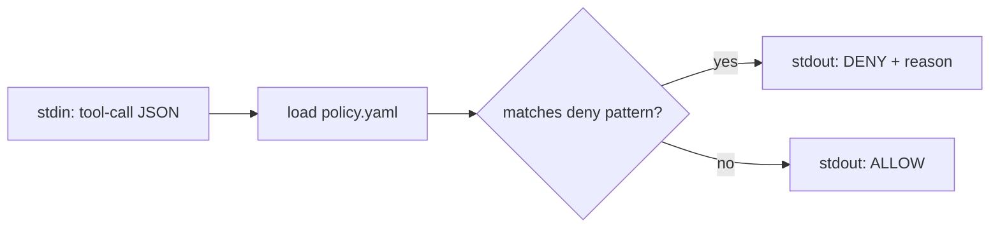
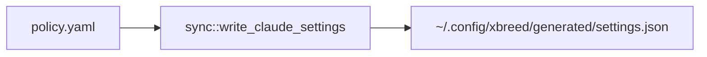
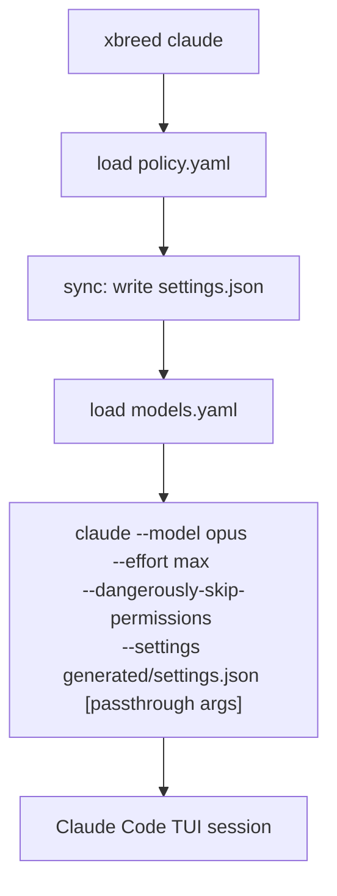
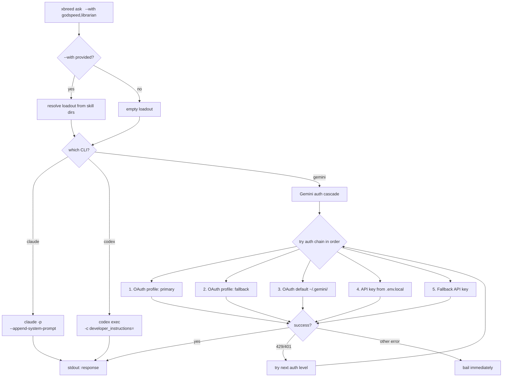
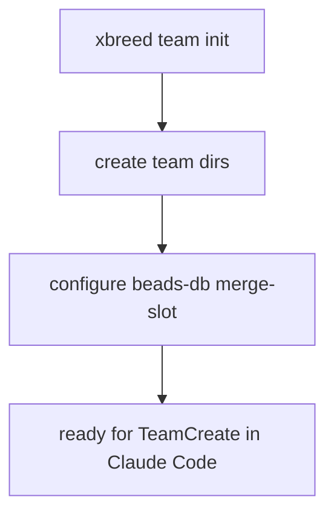
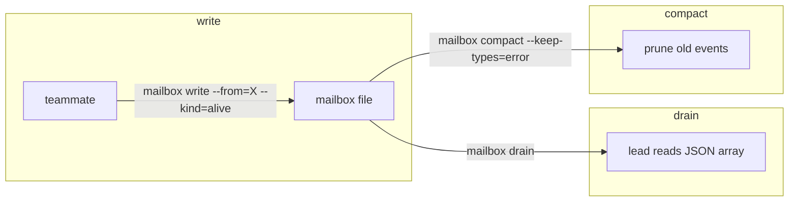
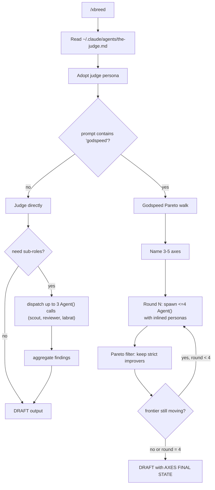
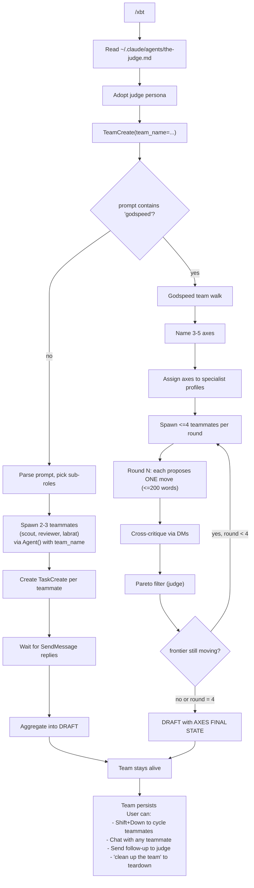
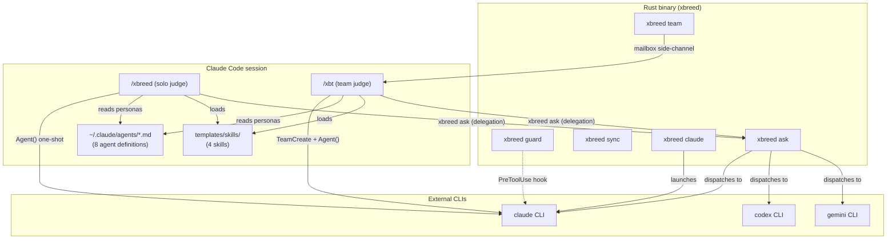

# Command Flow Reference

How each xbreed command works, from user input to final output.

## Overview

xbreed has two layers of commands:

| Layer | Commands | Runs as |
|-------|----------|---------|
| **Binary** (`xbreed`) | `guard`, `sync`, `claude`, `ask`, `team` | Rust CLI subprocess |
| **Skills** (inside Claude Code) | `/xbreed` (`/xb`), `/xbreed-team` (`/xbt`) | Prompt injection in active session |

The binary commands launch or configure CLI tools. The skills orchestrate
multi-agent workflows inside a running Claude Code session.

---

## Binary commands

### `xbreed guard <cli>`

Policy enforcement gate. Reads a tool-call JSON from stdin, checks it against
the deny-list policy, writes allow/deny to stdout.

Used by Claude Code's `hooks` system — wired as a `PreToolUse` hook so every
tool call passes through the policy before execution.

---

### `xbreed sync`

Regenerates per-CLI config files from the shared policy.

---

### `xbreed claude [args]`

Launches Claude Code in max-power mode with model/effort from config.

**Config sources:**
- `~/.config/xbreed/policy.yaml` — deny-list rules
- `~/.config/xbreed/models.yaml` — model + effort per CLI
- `~/.config/xbreed/generated/` — auto-generated settings

---

### `xbreed ask <cli> <prompt> [--with skills]`

Headless one-shot dispatch to any supported CLI.

**Loadout injection per CLI:**

| CLI | Mechanism | Flag |
|-----|-----------|------|
| claude | System prompt append | `--append-system-prompt` |
| codex | Developer instructions (TOML) | `-c developer_instructions=` |
| gemini | Prompt prepend (no native flag) | Loadout + `\n---\n` + prompt |

**Gemini auth cascade** (v0.3.5): tries up to 5 auth methods in order.
Cascades only on 429 (quota) or 401/403 (auth) errors. Non-retriable errors
bail immediately without wasting remaining auth levels.

---

### `xbreed team init [--with-beads]`

Scaffolds team infrastructure for a Claude Code agent team session.

### `xbreed team mailbox`

File-backed side-channel for fast teammate signals (bypasses SendMessage polling).

---

## Skill commands (inside Claude Code)

These are not binaries — they're prompt-injected skills that run inside an
active Claude Code session. The user types `/xbreed` or `/xbt` and the skill
content is loaded into the conversation.

### `/xbreed <prompt>` (alias: `/xb`)

Solo judge pipeline. Single-turn, no persistent team.

**Key difference from /xbt:** uses one-shot `Agent(subagent_type="general-purpose")`
with inlined personas. No persistent team, no teammate chat, no SendMessage
cross-critique. Everything happens within the judge's single turn.

**Dispatch rule:** prefers team-spawn path if already on a team. Falls back to
`general-purpose` with inlined persona body in solo mode (architectural quirk:
user-scope agent names only resolve inside team context).

---

### `/xbreed-team <prompt>` (alias: `/xbt`)

Judge-orchestrated persistent team. Multi-turn, real teammates.

**Key differences from /xbreed:**

| | `/xbreed` (solo) | `/xbt` (team) |
|---|---|---|
| **Substrate** | One-shot `Agent()` calls | Persistent `TeamCreate` + teammates |
| **Communication** | Results return to judge only | Teammates DM each other directly |
| **User interaction** | Judge session only | Shift+Down into any teammate |
| **Persistence** | Single turn, then done | Lives until user says "clean up" |
| **Cross-critique** | Judge does it in-session | Teammates DM critiques to peers |
| **Godspeed rounds** | Agent() batches per round | Real teammate spawns per round |

---

## How it all connects

---

## Quick reference

| Command | What it does | Needs team? |
|---------|-------------|-------------|
| `xbreed guard` | Policy check on stdin JSON | No |
| `xbreed sync` | Regenerate CLI configs | No |
| `xbreed claude` | Launch Claude Code (max power) | No |
| `xbreed ask <cli>` | Headless one-shot to any CLI | No |
| `xbreed team init` | Scaffold team infra | Creates one |
| `xbreed team mailbox` | Fast teammate signal channel | Uses existing |
| `/xbreed` (`/xb`) | Solo judge pipeline | No (uses Agent()) |
| `/xbreed-team` (`/xbt`) | Persistent judge + team | Yes (TeamCreate) |
