# Command Flow Reference

How each xbreed command works, from user input to final output.

## Overview

xbreed has two layers of commands:

| Layer | Commands | Runs as |
|-------|----------|---------|
| **Binary** (`xbreed`) | `guard`, `sync`, `claude`, `ask`, `team` | Rust CLI subprocess |
| **Skills** (inside Claude Code) | `/xbreed`, `/xbt`, `/xgs`, `/xbgst` | Prompt injection in active session |

The binary commands launch or configure CLI tools. The skills orchestrate
multi-agent workflows inside a running Claude Code session.

---

## Binary commands

### `xbreed guard <cli>`

Policy enforcement gate. Reads a tool-call JSON from stdin, checks it against
the deny-list policy, writes allow/deny to stdout.

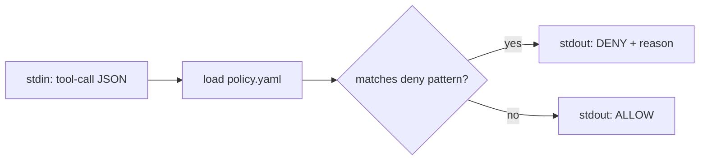

Used by Claude Code's `hooks` system — wired as a `PreToolUse` hook so every
tool call passes through the policy before execution.

---

### `xbreed sync`

Regenerates per-CLI config files from the shared policy.

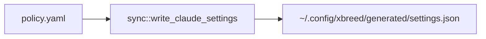

---

### `xbreed claude [args]`

Launches Claude Code in max-power mode with model/effort from config.

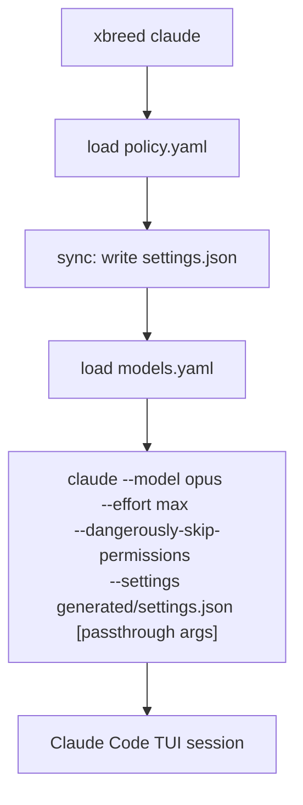

**Config sources:**
- `~/.config/xbreed/policy.yaml` — deny-list rules
- `~/.config/xbreed/models.yaml` — model + effort per CLI
- `~/.config/xbreed/generated/` — auto-generated settings

---

### `xbreed ask <cli> <prompt> [--with skills]`

Headless one-shot dispatch to any supported CLI.

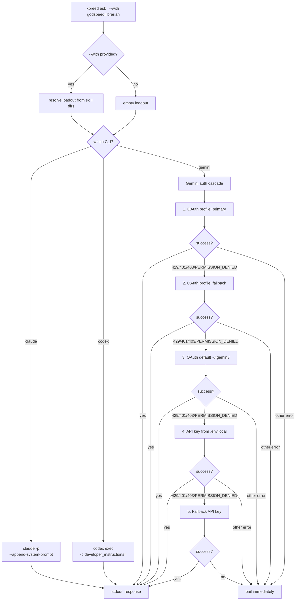

**Loadout injection per CLI:**

| CLI | Mechanism | Flag |
|-----|-----------|------|
| claude | System prompt append | `--append-system-prompt` |
| codex | Developer instructions (TOML) | `-c developer_instructions=` |
| gemini | Prompt prepend (no native flag) | Loadout + `\n---\n` + prompt |

**Gemini auth cascade** (v0.3.5): tries up to 5 auth methods **sequentially**
(not in parallel). Each attempt blocks on `cmd.output()` before the next starts.
Cascades on: 429 (quota), 401, 403, PERMISSION_DENIED, UNAUTHENTICATED,
API_KEY_INVALID. Non-retriable errors bail immediately per-attempt without
trying remaining auth levels. Empirical timing: OAuth ~14s, API key ~5-7s.

---

### `xbreed team init [--with-beads]`

Scaffolds team infrastructure for a Claude Code agent team session.

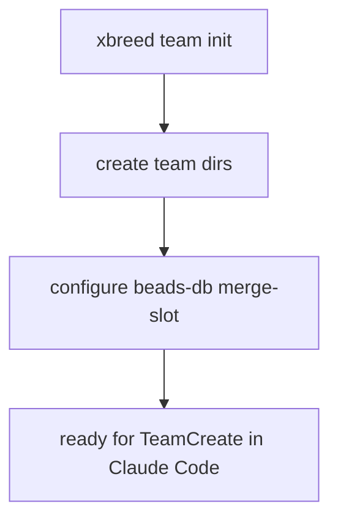

### `xbreed team mailbox`

File-backed side-channel for fast teammate signals (bypasses SendMessage polling).

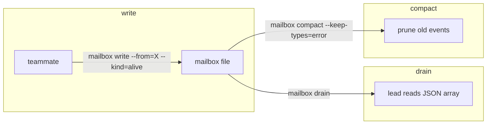

---

## Skill commands (inside Claude Code)

These are not binaries — they're prompt-injected skills that run inside an
active Claude Code session. The user types `/xbreed` or `/xbt` and the skill
content is loaded into the conversation.

### `/xbreed <prompt>` (alias: `/xb`)

Solo judge pipeline with cross-model delegation. Single-turn, no persistent team.

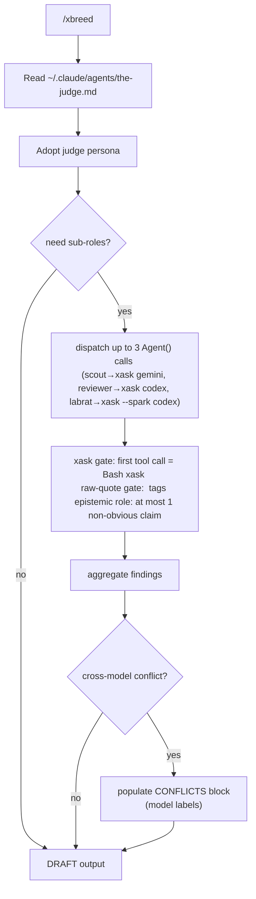

**Key difference from /xbt:** uses one-shot `Agent(subagent_type="general-purpose")`
with inlined personas. No persistent team, no teammate chat, no SendMessage
cross-critique. Everything happens within the judge's single turn.

**xask gate:** every sub-role brief requires `xask gemini`/`xask codex` as the
first tool call. Raw-quote gate requires verbatim CLI output in `<raw_output>` tags.

**Dispatch rule:** prefers team-spawn path if already on a team. Falls back to
`general-purpose` with inlined persona body in solo mode.

For godspeed Pareto mode, use `/xgs` (all-Claude) or `/xbgst` (cross-model).

---

### `/xbreed-team <prompt>` (alias: `/xbt`)

Judge-orchestrated deliberative team with cross-model delegation. Multi-turn, real teammates.

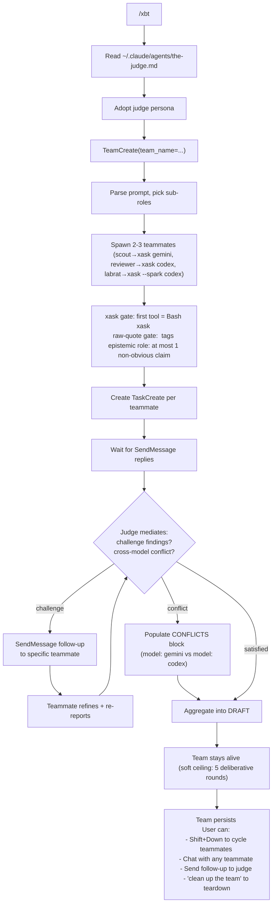

For godspeed Pareto mode, use `/xgs` (all-Claude) or `/xbgst` (cross-model).

**Key differences across commands:**

| | `/xbreed` | `/xbt` | `/xgs` | `/xbgst` |
|---|---|---|---|---|
| **Substrate** | One-shot Agent() | Persistent team | Persistent team | Persistent team |
| **Cross-model (xask)** | Yes | Yes | No (all-Claude) | Yes |
| **Iteration** | Single turn | Deliberative (5 cap) | Pareto walk (4 rounds) | Pareto walk (4 rounds) |
| **Cross-critique** | In-session | Teammate DMs | Teammate DMs | Teammate DMs |
| **Speed** | Fast | Slow, pondered | Fast | Medium |

---

### `/xgs <prompt>` — Godspeed Pareto (all-Claude)

Fast team mode. No cross-model delegation. Teammates use CC native tools.

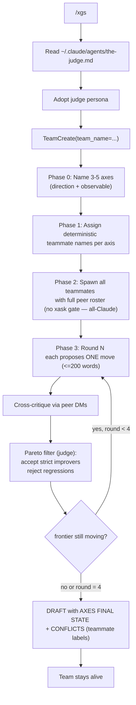

**4-phase spawn protocol:** axes must be named before teammate names are assigned,
and all names must be committed before any spawn. This prevents the peer-roster
ordering bug where early teammates lack peer names for cross-critique DMs.

---

### `/xbgst <prompt>` — Godspeed Pareto + Cross-Model Delegation

The full crossbreed. Godspeed Pareto walk with xask cross-model delegation.

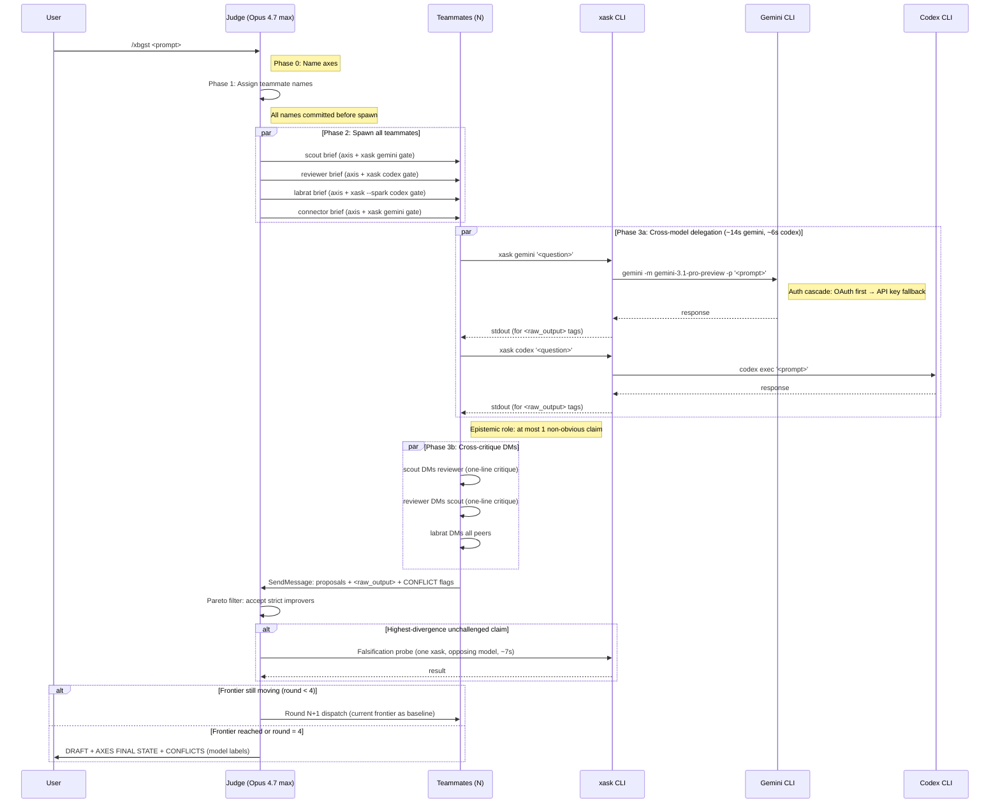

**Timing annotations** (from empirical labrat probes, 2026-04-12):

| Phase | Wall time | Bottleneck |
|-------|-----------|------------|
| Teammate spawn (4x parallel) | ~3s | CC agent initialization |
| xask gemini (per call) | ~14s | Gemini CLI + OAuth cascade |
| xask codex (per call) | ~6s | Codex exec |
| xbreed ask gemini --with godspeed | ~13s | Loadout resolution + dispatch |
| Cross-critique DMs | ~2-5s | Turn-boundary polling |
| Pareto filter (judge) | ~1-3s | In-session, no I/O |
| Falsification probe (optional) | ~7s | Single targeted xask |

**CONFLICTS block** uses model labels (not teammate labels):
```
CONFLICTS:
  - claim: <contested fact>
    model: gemini (via <teammate>) — <position>
    model: codex (via <teammate>) — <position>
    judge_resolution: <chosen + rationale>
```

---

## How it all connects

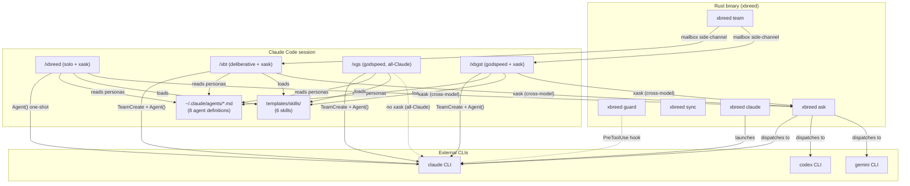

---

## Quick reference

| Command | What it does | Needs team? |
|---------|-------------|-------------|
| `xbreed guard` | Policy check on stdin JSON | No |
| `xbreed sync` | Regenerate CLI configs | No |
| `xbreed claude` | Launch Claude Code (max power) | No |
| `xbreed ask <cli>` | Headless one-shot to any CLI | No |
| `xbreed team init` | Scaffold team infra | Creates one |
| `xbreed team mailbox` | Fast teammate signal channel | Uses existing |
| `/xbreed` (`/xb`) | Solo judge + xask delegation | No (uses Agent()) |
| `/xbreed-team` (`/xbt`) | Deliberative team + xask | Yes (TeamCreate) |
| `/xgs` | Godspeed Pareto, all-Claude | Yes (TeamCreate) |
| `/xbgst` | Godspeed Pareto + xask | Yes (TeamCreate) |
