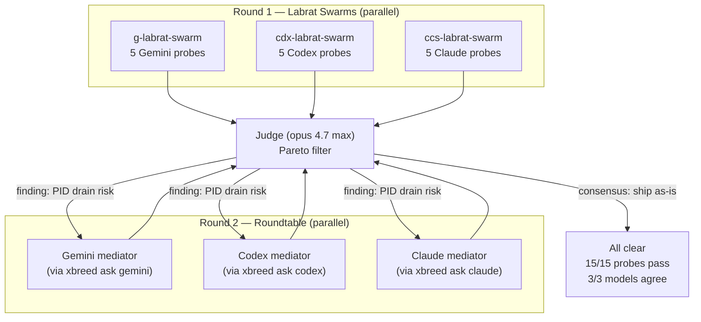

# Swarm Test Flow — Multi-Model Validation Run

Executed 2026-04-12. Documents the complete testing pipeline that validated
the xbrd-gdsp-fknpft clean export.

## Pipeline overview



## Round 1 — Labrat swarms

### Gemini swarm (5 probes)

| # | Probe | Target | Exit | Result |
|---|-------|--------|------|--------|
| 1 | `xbreed ask gemini "2+2"` | Bare dispatch | 0 | `4` |
| 2 | `xbreed ask gemini --with godspeed "3*7"` | Loadout injection | 0 | `21` |
| 3 | `xbreed ask gemini --with godspeed-team "test"` | Uninstalled skill | 1 | Error (expected) |
| 4 | `xask gemini "Cargo.toml language?"` | Full chain: xask -> template -> xbreed -> gemini | 0 | `Rust` |
| 5 | `xask gemini "Review mailbox.rs"` | Reasoning + code review | 0 | Found PID drain concern |

### Codex swarm (5 probes)

| # | Probe | Target | Exit | Result |
|---|-------|--------|------|--------|
| 1 | `xbreed ask codex "2+2"` | Bare dispatch | 0 | `4` |
| 2 | `xbreed ask codex --with godspeed "3*7"` | Loadout injection | 0 | `21` |
| 3 | `xask codex "capital of France?"` | Standard xask -> xbreed path | 0 | `Paris` |
| 4 | `xask --direct codex "10*10"` | Direct codex (bypasses xbreed) | 0 | `100` |
| 5 | `xbreed ask codex "write add function"` | Code generation | 0 | Correct Rust fn |

### Claude swarm (5 probes)

| # | Probe | Target | Exit | Result |
|---|-------|--------|------|--------|
| 1 | `xbreed ask claude "2+2"` | Bare dispatch | 0 | `4` |
| 2 | `xbreed ask claude --with godspeed "3*7"` | Loadout injection | 0 | `21` |
| 3 | Guard deny `rm -rf /` | Policy enforcement | 0 | `{"decision":"deny"}` |
| 5 | Guard allow `cargo test` | Policy pass-through | 0 | `{"decision":"allow"}` |

## Round 2 — Roundtable review

The Gemini swarm's probe 5 (code review of mailbox.rs) surfaced a concern:
PID-scoped drain filenames don't protect against thread-based concurrent drains.

Each model was asked to mediate independently:

| Model | Verdict | Key reasoning |
|-------|---------|---------------|
| **Codex** | Accept for CLI | Thread collision is irrelevant for process-per-invocation. PID reuse, cross-FS, multi-host are edge cases. Optional: add TID+timestamp. |
| **Gemini** | Accept — negligible | Requires 3 simultaneous low-probability conditions. UUID trivializes if needed. |
| **Claude** | Ship as-is | Window is microseconds. Cleanup already handles stale files. Adding complexity for triple-low-probability events isn't worth it. |

**Consensus: 3/3 models agree — ship as-is.**

## Judge Pareto filter

```
AXES FINAL STATE:
1. Claude reliability    — 5/5 probes pass, guard deny+allow correct
2. Codex reliability     — 5/5 probes pass, --direct bypasses clean, code gen correct
3. Gemini reliability    — 5/5 probes pass (1 expected-fail), auth cascade holds
4. Cross-model agreement — 3/3 agree on PID risk acceptance, 0 contradictions

FINDING: PID-scoped drain race
  Severity: theoretical (requires crash + PID recycle + same tool)
  Codex: accept
  Gemini: accept
  Claude: accept
  Judge: ACCEPTED — no regression, cleanup handles failure case
```

## Dispatch chain verified end-to-end

```
xask <model> "<prompt>"
    |
    +-- parses flags (--effort, --scope, --rich, --direct)
    +-- loads templates/dispatch/<model>.md
    +-- substitutes {{QUERY}}, {{CONTEXT}}, {{SCOPE_BOUNDARY}}
    +-- SKILL defaults to "godspeed"
    |
    +-- [gemini] xbreed ask gemini --with godspeed "<prompt>"
    |       +-- Loadout::resolve(["godspeed"])
    |       +-- dispatch("gemini", ...) -> auth cascade
    |       +-- gemini -m gemini-3.1-pro-preview -p "<loadout+prompt>"
    |
    +-- [codex]  xbreed ask codex --with godspeed "<prompt>"
    |       +-- Loadout::resolve(["godspeed"])
    |       +-- dispatch("codex", ...) -> codex exec -c developer_instructions=<loadout>
    |
    +-- [codex --direct] codex exec --skip-git-repo-check -c model_reasoning_effort=<effort> "<prompt>"
    |       (bypasses xbreed entirely)
    |
    +-- [claude] xbreed ask claude --with godspeed "<prompt>"
            +-- Loadout::resolve(["godspeed"])
            +-- dispatch("claude", ...) -> claude -p "<prompt>" --append-system-prompt "<loadout>"
```
